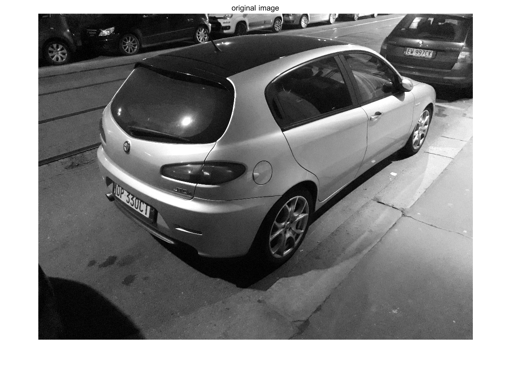
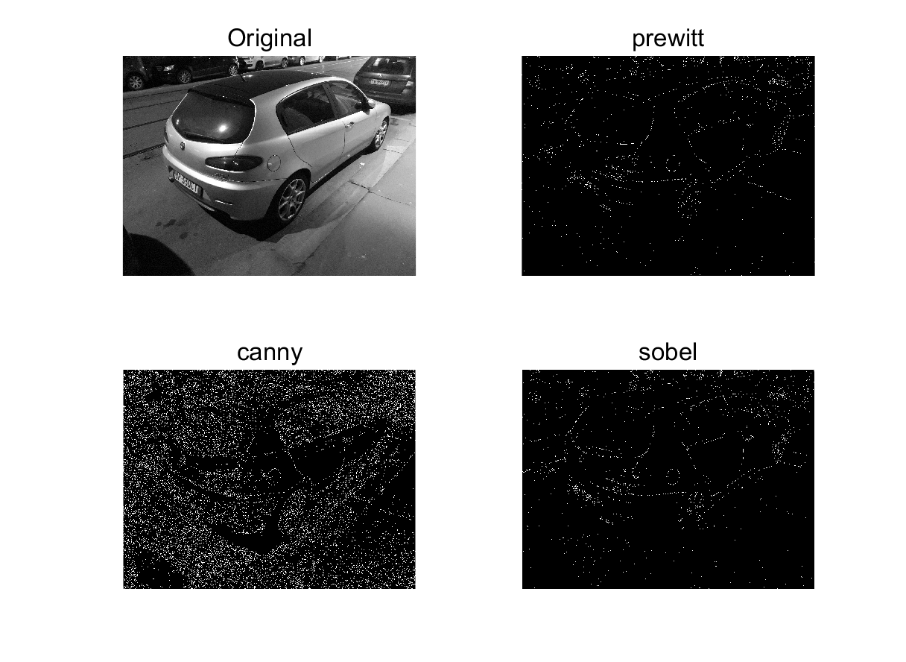
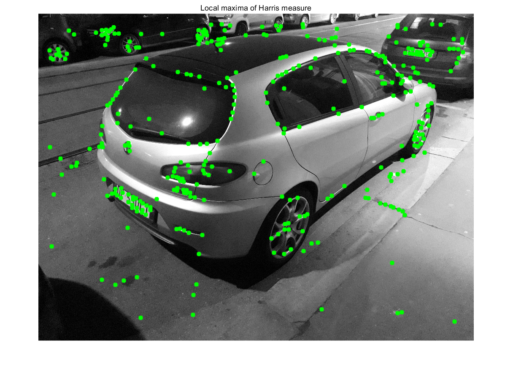
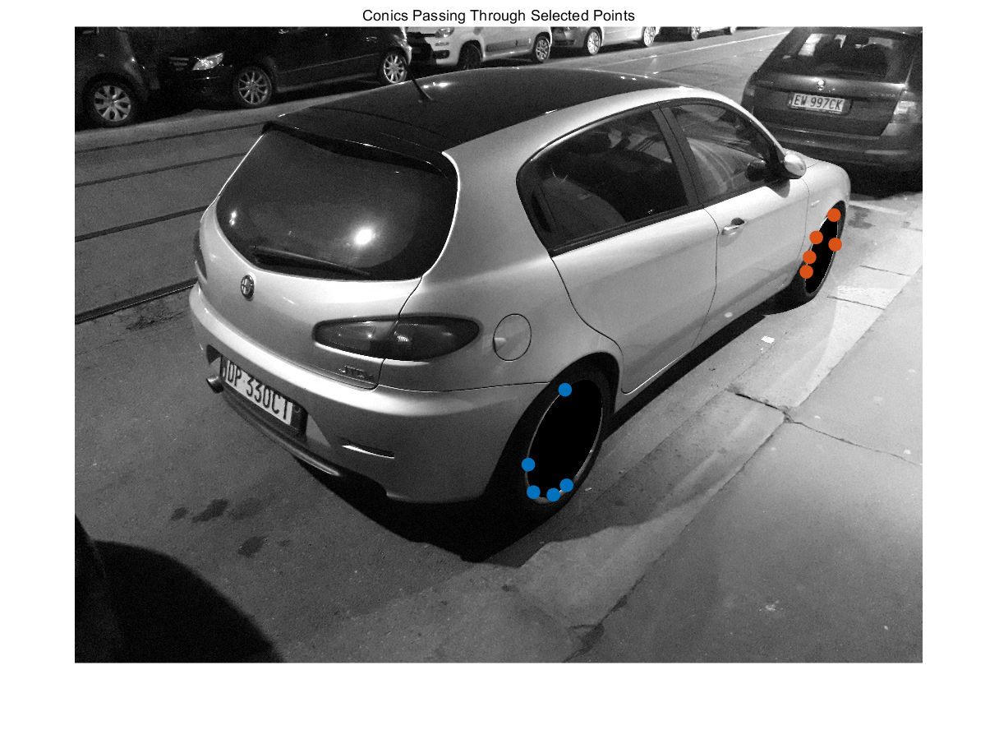
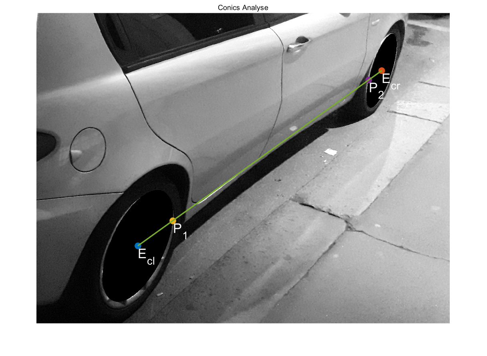
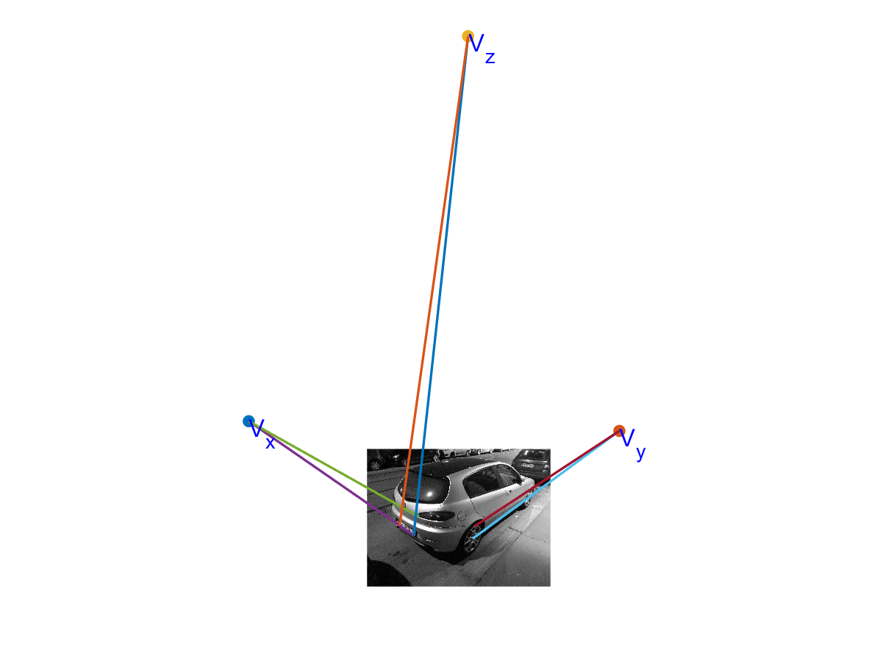
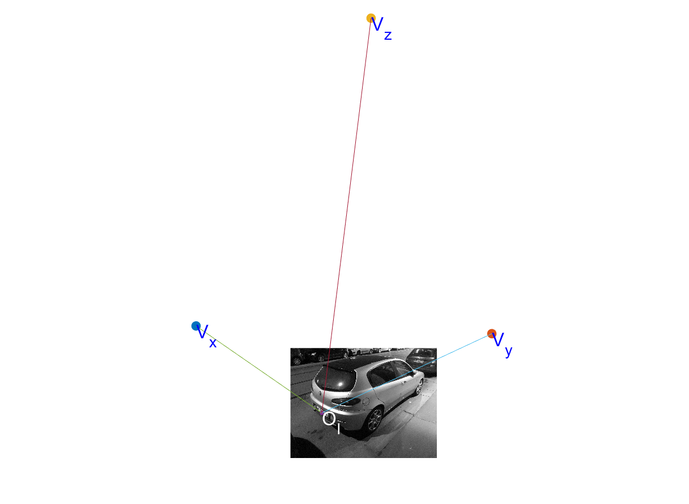
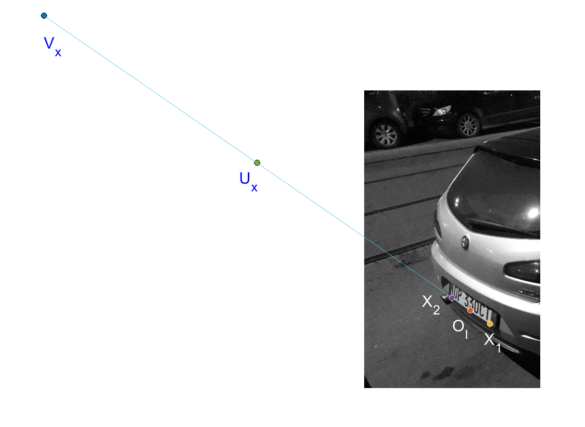

# Report for Homework

Name : Zhou Jingyu

Number : 10574823 / 898321

## Background
1. **What we have known**

    1. The car chassy is symmetric about a symmetry plane;
    2. The symmetry plane is vertical;
    3. Both the rear lights and the license plate are symmetric about the plane;
    4. The two wheels have the same diameter;
    5. The plane containing the two circular borders is parallel to the symmetry plane of the car chassy, thus it is also vertical.

2. **Assumptions**

    1. The experimental image `Im` is the gray image of **Image2**;

        ```
        Im = rgb2gray(imread('Image2'))
        ```
        
        
    2. The license plate is vertical, and this vertical plane also contains the two rear lights;
    3. The lower borders of the license plate has the same height above the street.
    4. The image coordinate is the same as the pixel coordinate. The homogeneous coordinates of each point are shaped like 
    $$point_I = \begin{bmatrix} u \\\\ v \\\\ 1 \end{bmatrix}$$
    5. The camera is zero-skew, thus the Intrinsic Parameter Matrix $K$ could be represented as
    $$ K = \begin{bmatrix}
        f_x & 0 & p_x \\\\
        0 & f_y & p_y \\\\
        0 & 0 & 1
    \end{bmatrix}$$
    where $\frac{f_x}{f_y}$ is equal to the pixel aspect ratio (in this image, it is $\frac{4128}{3096}$).


## Problem, Solution and Analysis

1. **Feature extraction and selection**

   1. Edge detection
        
        There is a built-in function `EDGE` for detecting edges in matlab.
        ```
        BW = edge(Im, calculator)
        ```
        where `Im` is the binarized image and `calculator` could be set as 'prewitt', 'canny', 'sobel', etc. 

        

   2. Corner detection

        Referenced [Prof. Giacomo's code](http://home.deib.polimi.it/boracchi/teaching/IAS/FeatureDetection/Feature_Detection.html). 

        

   3. Relevant ellipses
         
        In this image, there are 2 ellipses, which are the images of the two wheels of the car. After detecting edges and corners, many points on the ellipses are found. For each ellipse, I manually selected 5 points, then calculated the conic matrixs $C_l$ and $C_r$, representing left and right conic respectively.
        
        
         

2. **Geometry**

   1. Determine the ratio between the diameter of the wheel circles and the wheel-to-wheel distance

        
        
        let me use $r_c$, $d_c$ and $dist$ respectively to indicate the radius, diameter and distance between the wheels. I solved the ratio due to calculating the cross ratio. After calculating the matrixes $C_1$ and $C_2$, we could get their center's coordinates by 
        $$E_c = \begin{bmatrix}
            u_c\\\\v_c
        \end{bmatrix} = \begin{bmatrix}
            a & b/2 \\\\ b/2 & c/2
        \end{bmatrix}^{-1} \begin{bmatrix}
            -d/2 \\\\ -e/2
        \end{bmatrix}$$
        thus, $E_{c_1} = \begin{bmatrix} u_{c_1} \\\\ v_{c_1} \\\\ 1 \end{bmatrix} = \begin{bmatrix} 2387.3 \\\\ 2003.4 \\\\ 1 \end{bmatrix}$ and $E_{c_2} = \begin{bmatrix} 3636.7 \\\\ 1106.5 \\\\ 1 \end{bmatrix}$. Connect the two centers, and set them to intersect with the two ellipse at $P_1$ and $P_2$. We could calculate the cross ratio by
        $$CR_{E_{c_1}, P_1, P_2, E_{c_2}} = \frac{|P_2 E_{c_1}|}{ |P_2 P_1|} / \frac{|E_{c_2} E_{c_1}|}{ |E_{c_2} P_1|}  $$
        because the cross ratio is invariant, in reality world we have
        $$ CR_{E_{c_1}, P_1, P_2, E_{c_2}} = \frac{dist-r_c}{dist-2r_c} / \frac{dist}{dist-r_c} $$
        thus we could easily get the ratio $\frac{d_c}{dist} = 0.1763$.

   2. Determine the calibration matrix $K$

        Due to known conditions and assumptions, there are some pairs of lines that should be parallel in real world, thus we could find three orthogonal vanishing points $V_x$, $V_y$ and $V_z$.

        

        $$\begin{bmatrix}
            V_x & V_y & V_z
        \end{bmatrix} = \begin{bmatrix}
            -2661.9 & 5678.6 & 2273.5 \\\\
            -621.8 & -404.2 & -9285.6 \\\\
            1 & 1 & 1
        \end{bmatrix}$$

        then, according to 
        $${V_i}^T \cdot \omega \cdot V_j = 0 \quad (i \neq j)$$
        $$\omega = (K \cdot K^T)^{-1}$$
        we could get
        $$K = \begin{bmatrix}
            3886.8 & 0 & 1917.5 \\\\
            0 & 2915.1 & -1609.4 \\\\
            0 & 0 & 1
        \end{bmatrix}$$

   3. 3D relative coordinates for 3D reconstruction

        Firstly, I need to fix a reference frame at a suitable position on the symmetry plane of the car, and we know that, the vertical axis of symmetry of the license plate must be on this plane. So, I choose the point $O_w$ as the origin of the world 3D coordinate, which is the intersection point of the vertical plane and the bottom edge of the license plate.
        $$O_w = \begin{bmatrix}0 & 0 & 0 & 1\end{bmatrix}^T$$
        and $V_x$, $V_y$, $V_z$ is the $x$, $y$, $z$ axes.

        

        To solve the coordinate of $O_w$ in the image coordinate, which represented by $O_I$, we could use the cross ratio. Assume the lower borders of the license plate are $X_1$ and $X_2$, and the length in the world is $2L$.  
        $X_1$ and $X_2$ are colinear with $O_I$ and $V_x$, thus
        $$CR_{X_1, O_I, X_2, V_x} = \frac{|X_2 X_1|}{ |X_2 O_I|} / \frac{|V_x X_1|}{ |V_x O_I|} = \frac{2L}{L} = 2$$
        so that
        $$O_I = \begin{bmatrix}
            884.1 \\\\ 1828.7 \\\\ 1
        \end{bmatrix} $$

        We could construct such a $P_{3 \times 4}$ as
        $$P = \begin{bmatrix}
            M & m
        \end{bmatrix}$$
        where
        $$M = \begin{bmatrix}
            V_x & V_y & V_z
        \end{bmatrix} \quad m = O_I$$

        Now we have reconstructed a 3D world coordinate. We could find the pixel of the image of the unit point in x-axis $U_x$.

        $$U_x \propto P \cdot \begin{bmatrix}
            1 & 0 & 0 & 1
        \end{bmatrix}^T$$

        

        and the 3D position of $X_1$ and $X_2$ could be solved by using cross ratio again. Since they are on the x-axis,
        $$X_1 = \begin{bmatrix}
            -L & 0 & 0 & 1
        \end{bmatrix}^T \quad X_2 = \begin{bmatrix}
            L & 0 & 0 & 1
        \end{bmatrix}^T$$

        $$CR_{X_1, O_I, U_x, V_x} = \frac{|U_x X_1|}{ |U_x O_I|} / \frac{|V_x X_1|}{ |V_x O_I|} = \frac{1+L}{1} = 1+L$$

        thus $L = 0.0442$,
        $$X_1 = \begin{bmatrix}
            -0.0442 \\\\ 0 \\\\ 0 \\\\ 1
        \end{bmatrix} \quad X_2 = \begin{bmatrix}
            0.0442 \\\\ 0 \\\\ 0 \\\\ 1
        \end{bmatrix}$$
        
        In order to evaluate, I calculated $P \cdot X_1$ and $P \cdot X_2$, and finally got the same points on the image.


   4. 3D camera position

        The camera position $O$ could be solved by
        $$O = \begin{bmatrix}
            M^{-1} \cdot m \\\\ 1
        \end{bmatrix} = \begin{bmatrix}
            -0.6843 \\\\ -0.5838 \\\\ 0.2682 \\\\ 1
        \end{bmatrix}$$


